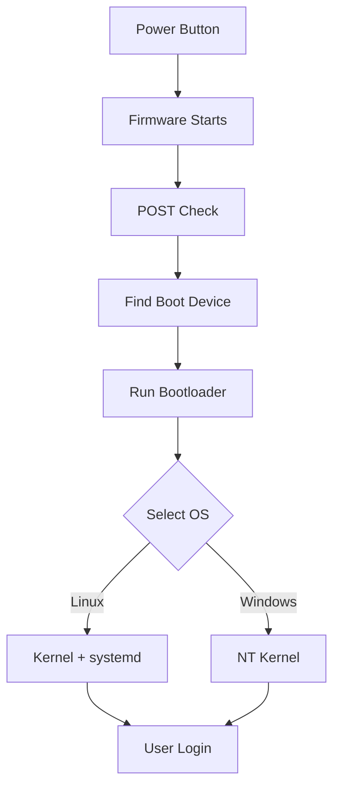

# Computer Boot Process: Essential Guide

## Table of Contents

1. [Overview](#overview)
2. [Boot Process Steps](#boot-process-steps)
3. [Partition Styles vs File Systems](#partition-styles-vs-file-systems)
4. [Boot Process Summary](#boot-process-summary)
5. [Frequently Asked Questions](#frequently-asked-questions)
6. [Resources](#resources)

## Overview {#overview}

The computer boot process transforms your computer from powered-off state to a fully operational system. This guide covers the essential steps and concepts needed to understand how computers start.

## Boot Process Steps {#boot-process-steps}

### Step 1: Firmware Initialization

When you press the power button:

- **CPU** executes the first program BIOS/UEFI
    - **BIOS** (Basic Input/Output System) - Legacy firmware (used in old computers)
    - **UEFI** (Unified Extensible Firmware Interface) - Modern firmware

### Step 2: POST and Boot Device Detection

**POST (Power-On Self Test):**

- Tests CPU, RAM, and storage devices
- Validates hardware components

**Boot Device Selection:**

- Reads **Boot Order** from firmware settings
- **GPT drives**: Looks for EFI System Partition
- **MBR drives**: Checks Master Boot Record in first sector

### Step 3: Bootloader Execution

**Common Bootloaders:**

Linux or Window bootloader, both can scan and start any OS windows or linux.   
- **Linux**: GRUB2, LILO, systemd-boot
- **Windows**: Windows Boot Manager

**Bootloader Tasks:**

- Scans partitions for installed operating systems
- Presents boot menu (if multiple OS found)
- Loads selected OS kernel into memory

### Step 4: Operating System Loading

**Linux OS Boot:**

1. Kernel loads and initializes hardware
2. **systemd** starts (modern init system)
3. System services launch
4. User login interface appears

**Windows OS Boot:**

1. **NT Kernel** (`ntoskrnl.exe`) loads
2. **Hardware Abstraction Layer** initializes
3. **Registry** and system drivers load
4. **Session Manager** starts Windows subsystems
5. **Windows Logon** presents login interface

## Partition Styles vs File Systems {#partition-styles-vs-file-systems}

### Partition Styles

Partition styles define how a drive is divided into sections:

| Feature | MBR | GPT |
| :-- | :-- | :-- |
| **Max Partitions** | 4 primary OR 3 primary + 1 extended | 128 primary |
| **Max Storage** | 2 TB | 18+ exabytes |
| **Boot Support** | BIOS only | BIOS + UEFI |

### File Systems

File systems determine how data is stored within partitions:

| File System | OS | Use Case |
| :-- | :-- | :-- |
| **NTFS** | Windows | System drives, large files |
| **FAT32** | Cross-platform | USB drives, compatibility |
| **ext4** | Linux | Linux system drives |
| **APFS** | macOS | macOS system drives |

## Boot Process Summary {#boot-process-summary}

| Phase | Component | Purpose |
| :-- | :-- | :-- |
| 1 | Firmware (BIOS/UEFI) | Hardware initialization |
| 2 | POST | Hardware verification |
| 3 | Bootloader | OS selection and loading |
| 4 | OS Kernel | System initialization |

## Frequently Asked Questions {#frequently-asked-questions}

### Q1: What's the difference between BIOS and UEFI?

| Feature | BIOS | UEFI |
| :-- | :-- | :-- |
| **Interface** | Text-only | Graphical possible |
| **Storage Support** | 2 TB max | No practical limit |
| **Security** | Basic | Secure Boot |
| **Speed** | Slower | Faster |

### Q2: What's the difference between partition style and file system?

**Partition Style:** Defines how the drive is divided (MBR vs GPT)
**File System:** Defines how files are stored within each partition (NTFS, ext4, etc.)

### Q3: Can I dual boot multiple operating systems?

Yes, by:

- Installing each OS on separate partitions
- Using a bootloader that detects all systems
- Selecting which OS to boot at startup

## Resources {#resources}

### Video Tutorials

- [Boot Process (English)](https://youtu.be/XpFsMB6FoOs?si=1I3NxtlIJxR_Rm15)
- [Boot Process (Hindi)](https://youtu.be/sebgrmiYdk4?si=2826LMkJMHlLhExv)
- [Windows Partitions (Hindi)](https://youtu.be/K2NsltEIUlI?si=AyBhrLQ6RItdx7QL)

